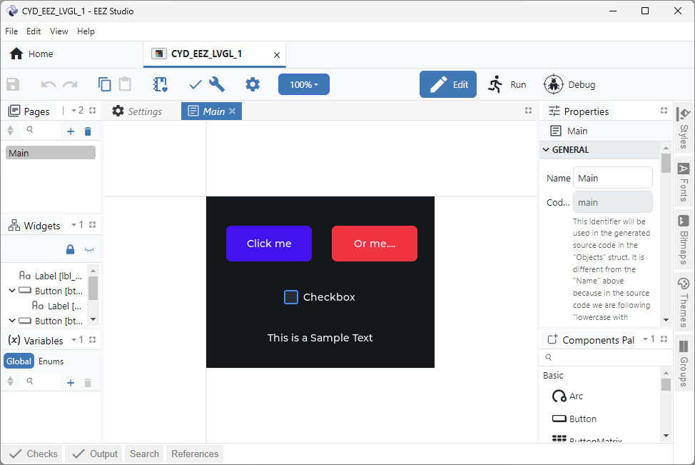
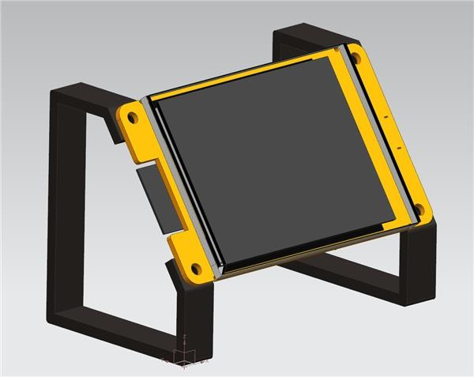
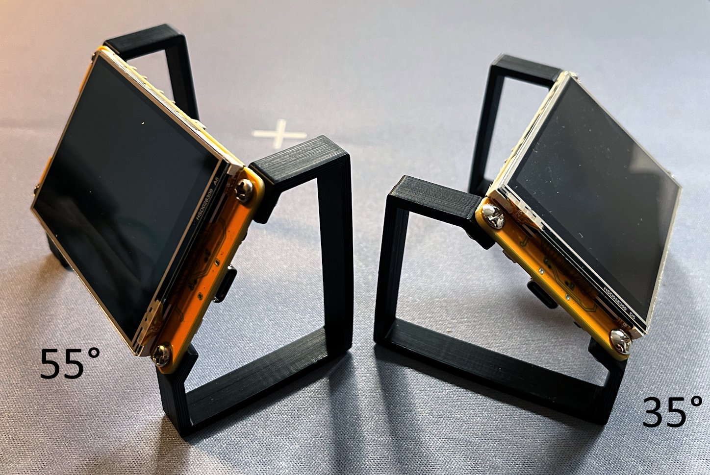
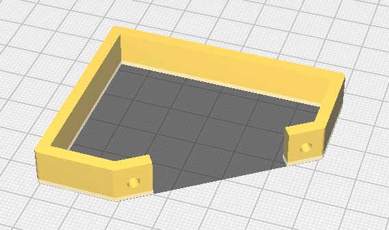

# ESP32_CYD
ESP32 "Cheap Yellow Display" Sample Project with usage of LVGL and EEZ Studio

## Introduction
By accident I found the "Cheap Yellow Display" board which is a cool piece of equipment for "maker nerd geeks" (like myself). My goal was to establish a cool dev environment to use the CYD at it's best. Here is the result:


## Dev Environment
I used to work with the classic Arduino IDE with ESP8266 and ESP32 projects, but with this project I decided to switch finally to PlattformIO because the Arduino IDE build times are much longer when a project gets more complex...

## Build hints
My PlatformIO configuation is pretty simple:

```
[env:esp32dev]
platform = espressif32
board = esp32dev
framework = arduino
monitor_speed = 460800
lib_deps = 
	lvgl/lvgl@^9.3.0
	bodmer/TFT_eSPI@^2.5.43
```
**IMPORTANT**: For the touch function of the CYD you need the library **XPT2046_Touchscreen** from Paul Stoffregen **Version 1.4** [(Click here)](https://github.com/PaulStoffregen/XPT2046_Touchscreen) which can't be found with the PaltformIO Library Management. I just downloaded the stuff and used it as loacal lib in folder **/lib** which is part of this repository. Feel free to exchange it with a newer version in case you find one.

## The /src Folder
This is the **very cool** part of the project. The only two files i wrote myself (by copying code from here and there) are these:

```
main.cpp
touchscreen.h
```
It's mainly to initialize the TFT (rotation, touch) and the serial interface in **touchscreen.h**. The clean definition of event handlers for Buttons etc is in **main.cpp**.

## EEZ Studio

The other files were generated by the very cool tool **EEZ Studio** which generates C Code from a kind of "Form Designer" interface. 



The generated code is LVGL compatible, so that all the source files in the following list must not be touched and can me modified by **EEZ Studio**

```
actions.h
fonts.h
images.c
images.h
screens.c
screens.h
structs.h
styles.c
styles.h
ui.c
ui.h
vars.h
```

## 3D Stuff

Are you a **Maker**? I'm asking because you might have a Platform-IO toolchain setup **and** a 3D-printer? If the answer is yes and you purchased the CYD somwhere and you own a 3D-Printer and you need some stands for your CYD just have a look here:



The CYD Stand (you need 4 M3 x 10 screws and 4 M3 bolts on top) can be used with 55° as well as 35° angle. Take your pick...



So if you like, feel free to use the STP File **ESP32_STAND_V2.stl** provided in folder **3D_PRINT** to lift your CYD a bit off the table...




